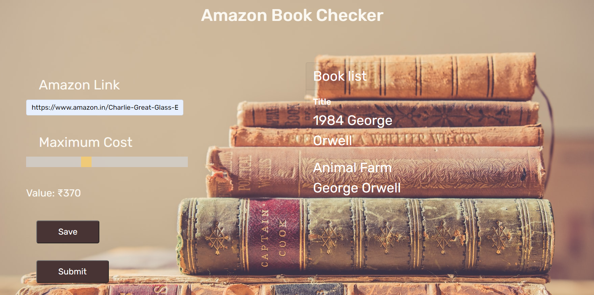
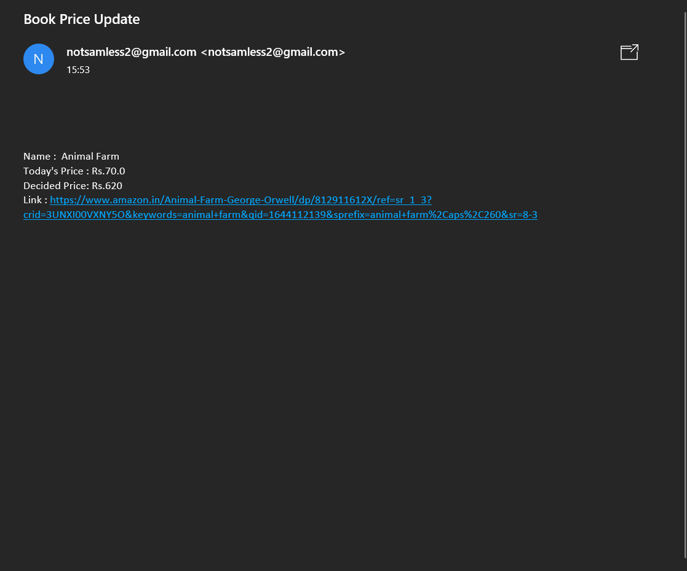

# AMAZON BOOK PRICE WEBSITE
## About 
A website which store the amazon book links and mails the user when the books are cheaper. 

## Data
Stores the data in a nosql database

## Website 

### Login Page 

### Index Page 

### Confirmation Page 

### Email Function 

## Features
1. Saves Email Id.
2. Saves the Maximum Price. 
3. Mailing function. 

### Modules Used 
1. os
2. flask
3. firebase_main , firebase_admin
4. dotenv 
5. json 
6. regex

